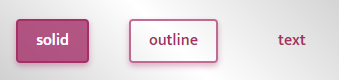

# thunderui

> A powerful UI as thunder

[](https://www.npmjs.com/package/thunderui) [](https://standardjs.com)

## Install

```bash
npm install --save thunderui
```

## Settings

### Set button text with text property

```jsx
<Button text="Hello world" />
```

***

### Colors


#### default color:primary

```jsx
<Button color="info" />
```

***

### Types



#### default type:solid

```jsx
<Button type="outline" />
```

***

### Sizes


#### default size:medium

```jsx
<Button size="large" />
```

***

### Disabled


```jsx
<Button text="i am disabled" disabled/>
```

***

### You can set all button properties

```jsx
<Button onClick={()=> alert("Hello world")} />
```

## Usage

```jsx
import React from 'react'

import {Button} from 'thunderui'
import 'thunderui/dist/index.css'

export default function Example() {
  return <Button text="I am thunderui button" />
```

## License

MIT © [talhaekrem](https://github.com/talhaekrem)
